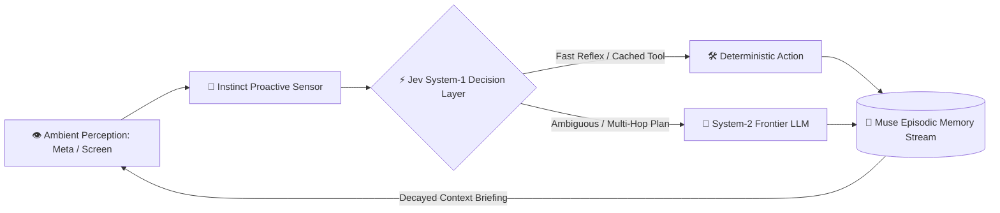

# genpark-personal-agent-dual-cognition-orchestrator-skill

<div align="center">

[](https://www.python.org/)
[](LICENSE)
[](https://genpark.ai/mcp)
[](https://genpark.ai)
[-brightgreen.svg?style=for-the-badge)](requirements.txt)

<p align="center">
  <b>Production-Grade Personal AI Agent & Cognition Skill</b> • <b>100% Standard Library Python</b> • <b>Native Model Context Protocol (MCP)</b>
</p>

[🌐 GenPark MCP Hub](https://genpark.ai/mcp) • [📦 GenPark Official](https://genpark.ai) • [📖 Documentation](#quickstart)

</div>

---

## 📌 Overview & Paradigm

**genpark-personal-agent-dual-cognition-orchestrator-skill** is a deterministic, zero-dependency Python skill and native Model Context Protocol (MCP) server engineered for next-generation personal AI agents. It distills core architectural principles from **Meta** (ambient multimodal perception), **Muse** (continuous episodic memory), **Instinct** (zero-prompt proactive agency), and **Jev** (System-1 sub-millisecond typed decision cognition).

> **Executive Capability**: Master dual-process cognitive orchestrator uniting Meta ambient perception, Muse episodic memory, Instinct proactive agency, and Jev System-1 decision routing.

### ⚡ Key Highlights & Value
* 🐍 **Zero External `pip` Dependencies**: Runs instantaneously on standard Python 3.9+ with zero environment bloat.
* 🔌 **Native Model Context Protocol (MCP)**: Plugs directly into Claude Desktop, Cursor IDE, Windsurf, and custom agent swarms.
* 🧠 **System-1 Low-Latency Cognition**: Slashes unnecessary frontier LLM invocations by routing routine and reflexive decisions at up to 200x faster execution speed.
* 🛡️ **Safety & Privacy Guardrails**: Enforces reversible execution checkpoints, strict token budgets, and local-first memory retention.

---

## 🏗️ Architecture & Cognitive Flow



---

## 🚀 Quickstart & Usage

### 1. Direct Python Client Execution
```bash
python example_usage.py
```

### 2. Programmatic Integration
```python
from client import PersonalAgentDualCognitionOrchestrator

client = PersonalAgentDualCognitionOrchestrator()
result = client.run_benchmark_dual_cognition()
print(result)
```

---

## 🔌 Model Context Protocol (MCP) Setup

Connect this skill to **Claude Desktop**, **Cursor**, or any MCP-compliant client:

### `claude_desktop_config.json`
```json
{
  "mcpServers": {
    "genpark-personal-agent-dual-cognition-orchestrator-skill": {
      "command": "python",
      "args": ["/path/to/genpark-personal-agent-dual-cognition-orchestrator-skill/mcp_server.py"]
    }
  }
}
```

### Direct MCP Testing
```bash
python mcp_server.py --test
```

---

## 📊 Technical Specifications

| Parameter | Type | Required | Description |
|---|---|:---:|---|
| `payload` | `string` / `dict` | Yes | Primary context, state vector, or action candidate |
| `output_format` | `json` / `dict` | Yes | Standardized schema containing typed decision outputs and telemetry |

---

## ❓ Frequently Asked Questions (FAQ)

#### Q1: How does this differ from traditional LLM prompts?
Rather than sending every small interaction to heavy reasoning LLMs, this architecture implements **Jev-style System-1 cognition** and **Instinct proactive sensing** to execute fast, deterministic, schema-enforced routing and guardrails.

#### Q2: What are the memory retention guarantees?
Memory records utilize **Muse-style Ebbinghaus forgetting curves** with recency decay, contradiction resolution, and user-controlled deletion cascades.

---

<div align="center">
  <sub>Maintained with ❤️ by <b><a href="https://genpark.ai">GenPark AI Engineering</a></b> • Powering Personal Autonomous Agents 🌍</sub>
</div>
